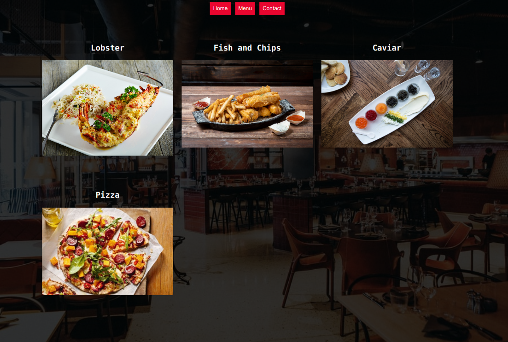

# Minimalist Restaurant (minimalist-restaurant-page)

This is a mini-project that allows uses DOM manipulation to create a minimalist restaurant website.



### Live Demo

[Live Demo Link](https://newhorizon-tech.github.io/minimalist-restaurant-page/)

## Built With

- HTML/CSS
- Javascript
- NPM
- Webpack
- Atom


## Getting Started

- Clone the repository
- Navigate to the root directory of the project
- Go to the 'dist' directory ```cd dist```.
- Open index.html or run it using your own live server

## Authors

👤 **Alaukik**

- Github: [@newhorizon-tech](https://github.com/newhorizon-tech)
- Twitter: [@techintosh3](https://twitter.com/techintosh3)


## Acknowledgements

- Unsplash
- The Odin project
- MDN Web Docs


## 🤝 Contributing

Contributions, issues, and feature requests are welcome!

Feel free to check the [issues page](https://github.com/newhorizon-tech/minimalist-restaurant-page/issues).

## Show your support

Give a ⭐️ if you like this project!
